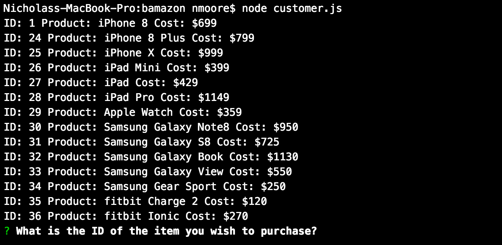
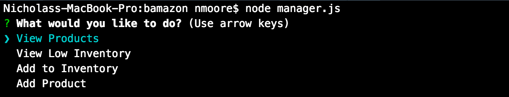
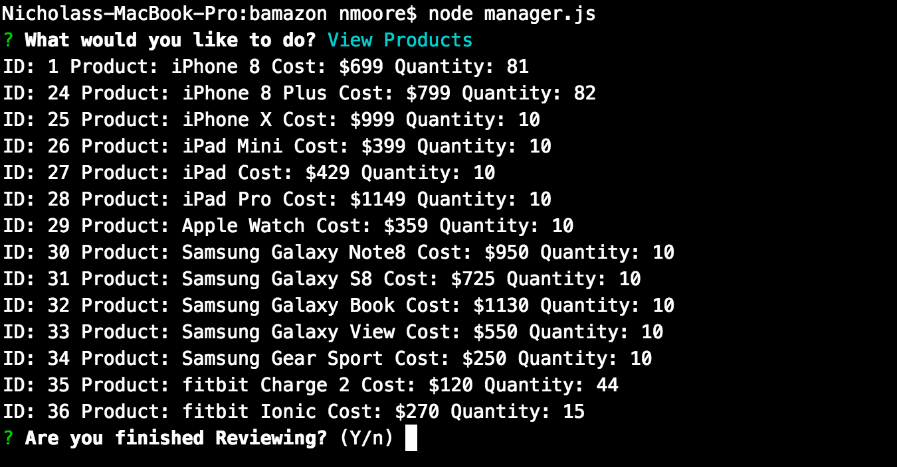
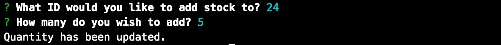
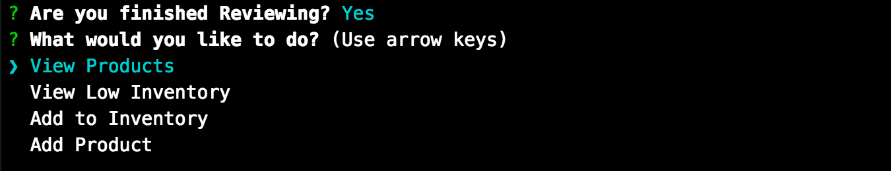

# bamazon
This is a node based store app. 

# customer view
The customer view is the main (currently only) view working in this app. It is accessed via running customer.js.
Once your are in customer view you will be given a list of the items in the store. This list will contain a unique ID for each item, an item name and a cost, ie: 'ID: 1 PRODUCT: iPhone 8 COST: $699'.

The customer will be asked what item they would like to purchase and then they will be asked how many of the given item they would like to purchase. Upon responce to both of these the system will check if there is suffecient stock to fill the order, if there is, the order will be placed and the customer will be given a total cost for the purchase. 

After the customer makes a purchase the product Db will be updated to reflect the change in stock of the purchased item. And the customer will be again asked if they would like to make a purchase.

# manager view
The manager view is second way to access the bamazon app. It is accessed via running manager.js. This view would be used for a store manager to view all inventory, view only low inventory, add to inventory, and add a whole new product to sell. 

Using the arrow keys to select what task you would like to perform will navagate to the different menu items.

The view all inventory shows the ID, product, cost, and stock. ie:  'ID: 1 PRODUCT: iPhone 8 COST: $699 Quantity: 81'.

The view low inventory shows the same information as the view all however it will only display items with an inventory less then 5. (at the time of making this all my inventory items were above 5 quantity.

The add inventory item lets you add stock of any item currently in the store. You simply use the ID to select the item you are targeting and then tell it how many you want to add. 

After any taskes are performed in the manager view another function runs asking if you are done in the current view and brings you back to the main menu.

